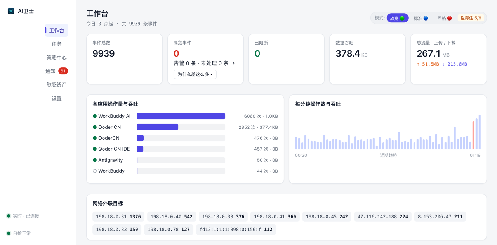
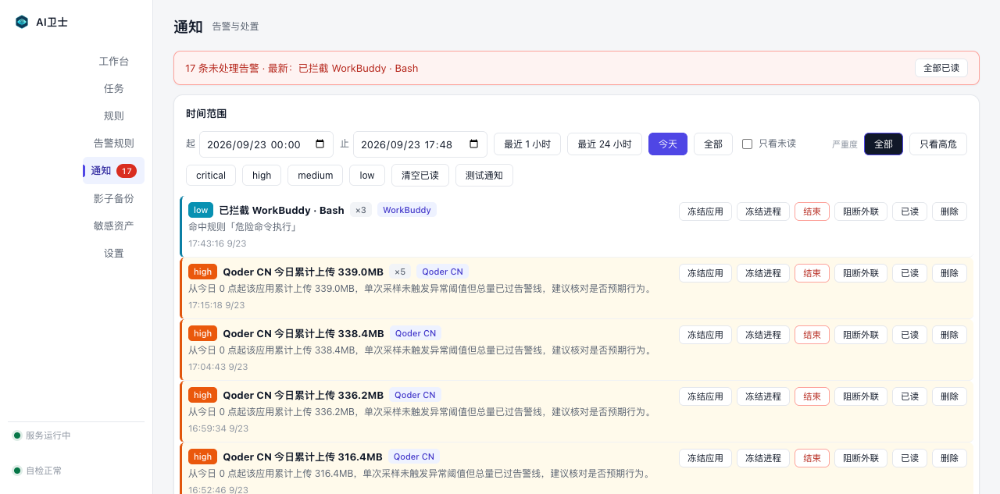
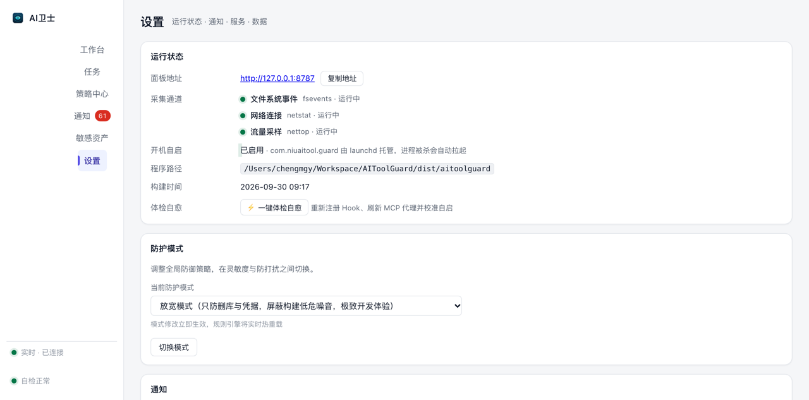

# AI卫士

本机 AI 行为监控工具：记录本机所有 AI 编码工具干了什么——改了哪些文件、跑了什么
命令、连了哪些外部地址、传了多少数据。发现危险动作立刻告警，能拦的先拦，
拦不住的如实记录，事后可以退回去。

> 本仓库**只分发构建产物**，不含源码。

---

## 下载

到 [Releases](../../releases/latest) 页面下载（最新版）：

| 文件 | 用途 |
|---|---|
| `AIGuard.app.zip` | **推荐**。解压后拖进「应用程序」，双击即用 |
| `aitoolguard-macos-arm64` | 命令行版，单文件、不需要装 Python |
| `SHA256SUMS.txt` | 校验和 |

**系统要求**：macOS 12 以上，Apple Silicon（arm64）。

## 安装

1. 下载 `AIGuard.app.zip` 并解压
2. 把 `AI卫士.app` 拖进「应用程序」
3. **双击**。它会起服务、打开面板、并把开机自启装上

之后它常驻菜单栏，没有 Dock 图标、没有窗口：

| 图标 | 意思 |
|---|---|
| 🟢 | 正常，没有未处理告警 |
| 🟠 | 有未处理告警 |
| ⚠️ | 自检发现异常 |
| ⚫️ | 服务没在跑 |

面板地址 <http://127.0.0.1:8787>。

### 界面预览



*工作台：进门第一屏，未处理告警置顶，下面是今天的规模、谁在动、往哪传。*



*通知页：告警列表与处置（冻结 / 恢复 / 结束 / 阻断外联）。*



*设置页：运行状态、通知策略、服务参数、数据清理。*

若系统提示「无法验证开发者」或「已损坏」（本工具没有开发者签名），
右键点图标 → 打开 → 确认；或者在终端执行一次：

```bash
xattr -dr com.apple.quarantine "/Applications/AI卫士.app"
```

## 它能做到哪一步

| 通道 | 能看到 | 能拦住吗 |
|---|---|---|
| 文件 / 网络旁路 | 全部客户端的增删改、外联目标、上下行流量 | **不能**——事件到达时操作已经完成 |
| 事前拦截（hook / MCP） | 工具调用的参数、要动手的文件 | **能**，需要额外执行一次 `install` |

默认装上的是「看得见 + 事后能退」。想要「真拦住、动手前先备份」，
再执行一次：

```bash
"/Applications/AI卫士.app/Contents/MacOS/aitoolguard" install
```

## 数据

全部在 `~/Library/Application Support/AI Tool Guard/` 下：事件库、运行日志、
影子备份、会话令牌。**只在本机**，不上传、不联网上报。

## 卸载

```bash
"/Applications/AI卫士.app/Contents/MacOS/aitoolguard" uninstall            # 摘掉 hook 与 MCP 网关
"/Applications/AI卫士.app/Contents/MacOS/aitoolguard" autostart uninstall  # 停服务并取消自启
```

然后把「应用程序」里的 `AI卫士.app` 丢进废纸篓。
监控记录要一起清的话，删掉 `~/Library/Application Support/AI Tool Guard/`
（里面有事件库和影子备份，删掉找不回来）。

## 校验

```bash
shasum -a 256 -c SHA256SUMS.txt
```

## 从源码构建

本仓库不提供源码。
